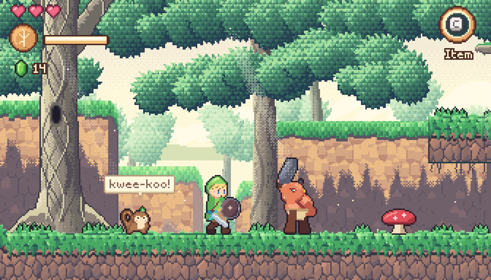
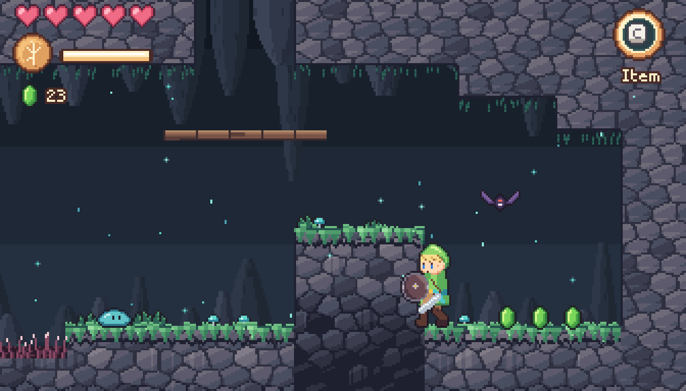
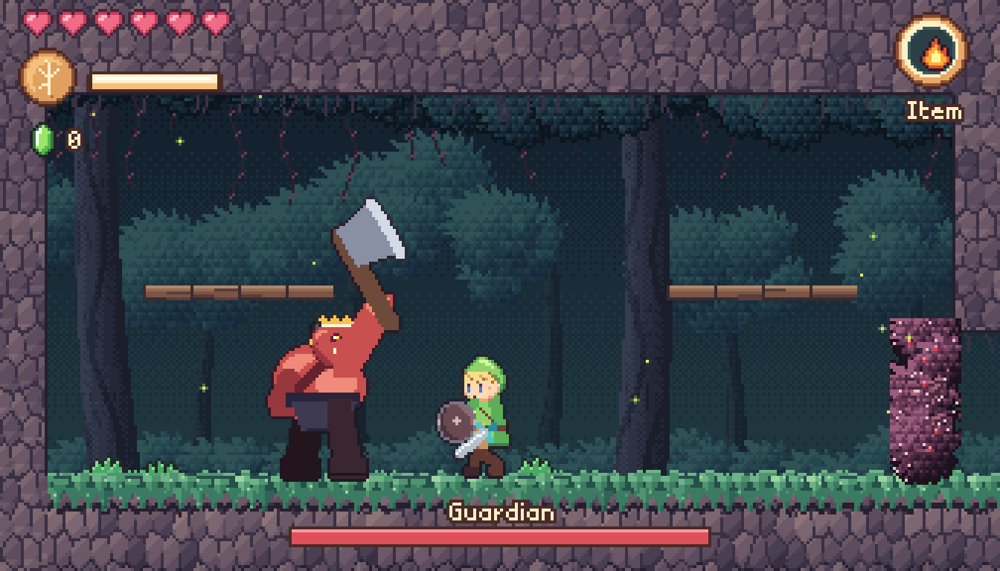

# Mini Zelda II — The Whispering Wood

A tiny side-scrolling action-adventure in the spirit of *Zelda II: The Adventure of Link*,
built as a metroidvania: one small, interconnected forest where new abilities open up
paths you have already seen.

**Play it in the browser:** https://mattias800.github.io/minizelda2d/



| | |
| --- | --- |
|  |  |

The world is deliberately small (seven rooms), but it has the full loop: explore, find an
ability, backtrack to places that were out of reach, collect heart containers, and take
down the Guardian.

## Controls

| Action | Keyboard | Gamepad |
| --- | --- | --- |
| Move | Arrow keys / WASD | D-pad / left stick |
| Jump (press again mid-air once you have the Feather) | Z / Space / J | A |
| Sword | X / K | B or X |
| Fire spell (costs magic) | C / L | Y / LB / RB |
| Crouch (low stab, low shield) | Down | Down |
| Down-thrust (bounce on enemies) | hold Down in the air | |
| Up-thrust | hold Up in the air | |
| Talk / open / rest | Up | Up |
| Drop through a branch | Down + Jump | |
| Map & pause | Enter / Tab / Esc | Start / Back |
| Mute | M | |

Your shield blocks spears: stand to block high throws, crouch to block low ones.

Any controller the browser recognises works (Xbox/PlayStation layouts and most generic USB
pads). Browsers only allow sound after a key press or click, so tap a key once for audio.

## The world

```
            [ High Canopy        ][ Shrine ]
[ Lair ][ Hollow ][ Whispering Clearing ][ Old Forest Path ]
                                          [ Mossy Cavern   ]
```

* **Roc's Feather** gives you a double jump and opens up the canopy.
* The **Fire** spell burns away brambles, including the thorn hedge that blocks the way west.
* Four heart containers are hidden around the wood. One of them has to be bought.
* Save stones heal you and save your progress. Anything you pick up is kept when you move
  between rooms, and after a game over you continue from the last stone you rested at.

## Running locally

```bash
npm install
npm run dev        # http://localhost:5199
npm run build      # production build in dist/
```

## How it's made

There are no image or audio files. Every pixel is generated by code when the game starts,
and the palette and proportions were matched against a style reference: warm cream light,
teal-leaning greens, rosy cobbled earth, chevron-leaf grass and soft god rays. The music
and sound effects are synthesized with WebAudio.

TypeScript + Vite, no game engine. The native resolution is 336×192, scaled up by whole
pixels to fit the window.

```
src/
  core/      game-agnostic bits: math/RNG/noise, input (keyboard + gamepad), audio synth + sequencer
  gfx/       rendering: pixel buffers, sprites, font, procedural terrain, parallax, atmosphere
    sprites/ hero, moblins, creatures, props, HUD pieces (hand-pixeled grids + posed painters)
  world/     tile map, collision/physics (slopes, one-way platforms), room data
  entities/  player, enemies, boss, pickups, props, projectiles, effects
  game/      Game (state machine / GameHost), Scene (one live room), progress + saving, music
  ui/        HUD, dialog box, speech bubble, map screen, title / game over / ending
  dev/       art previews (?preview=...)
```

Some pointers for extending it:

* **Rooms** live in `src/world/rooms.ts` as ASCII maps, with the legend at the top of the
  file. A room's `gx/gy` places it on the world grid, and neighbouring rooms connect
  automatically wherever their edges are open. The map screen is drawn from the same data.
* **Terrain art** comes from the collision map (`src/gfx/terrain.ts`), so editing a level
  never needs new tiles.
* **Enemies** extend `Enemy` in `src/entities/entity.ts`, which handles HP, knockback, hit
  flashes, loot and persistent death flags.
* **Characters** are posed from data. The hero is a hand-pixeled head on a procedurally
  drawn body (`src/gfx/sprites/hero.ts`), so a new animation is just another `Pose`.

### Dev tools

* `npm test` runs the end-to-end regression suite (`tools/regression.mjs`) against the running
  dev server, using headless Edge. It walks the critical path: room transitions, ability gates,
  chests, the brute, the Guardian, saving, game over and the squirrel's trade.

* `?room=cavern&items=feather,fire&hearts=6&x=100&y=160` starts straight in a room.
* `?preview=sheet&set=hero|moblin&zoom=4` and `?preview=room&room=clearing` show art previews.
* `node tools/sim.mjs "<query>" "<steps>"` runs a deterministic, scripted play-test in headless
  Edge. For example, `"20:right;1:attack;shot:hit;eval:game.progress.hp"`. `tools/bot.js` adds
  simple fighting bots that were used to balance the brute and the boss.
* `node tools/check-music.mjs` checks that every channel of every song loops in sync.

---

A non-commercial fan project. *The Legend of Zelda* is a trademark of Nintendo.
